# Biblioteca Geek Fullstack


Sistema web full stack acadêmico para gestão de Biblioteca Geek com Node.js, Express, MySQL, MongoDB, JWT, MVC, Service Layer, Router e Middleware.

## Sumário

- [Sobre o projeto](#sobre-o-projeto)
- [Funcionalidades](#funcionalidades)
- [Tecnologias utilizadas](#tecnologias-utilizadas)
- [Arquitetura usada](#arquitetura-usada)
- [DER](#der)
- [Demonstração rápida](#demonstração-rápida)
- [Screenshots](#screenshots)
- [Pré-requisitos](#pré-requisitos)
- [Como rodar](#como-rodar)
- [MongoDB e logs](#mongodb-e-logs)
- [Relatório PDF](#relatório-pdf)
- [JSON](#json)
- [Upload de imagens](#upload-de-imagens)
- [Documentação](#documentação)
- [GitHub Pages](#github-pages)
- [Release](#release)
- [Licença](#licença)
- [Checklist resumido](#checklist-resumido)

## Sobre o projeto

O **Sistema Biblioteca Geek** controla livros de uma biblioteca com tema geek/nerd. O usuário autenticado pode cadastrar autores, categorias, livros com imagem de capa, empréstimos e itens de empréstimo.

O projeto também possui pesquisa, importação/exportação JSON, logs em MongoDB, exportação XML, relatório PDF no frontend e gráfico com Chart.js. A tela de livros traz um modal de detalhes com capa, autor, categoria, ano, páginas, editora, ISBN, quantidade disponível e sinopse.

## Funcionalidades

- Login, cadastro e logout com JWT.
- Rotas públicas e privadas.
- CRUD de autores, categorias, livros e empréstimos.
- Pesquisa de livros por título.
- Upload e exibição de capa dos livros.
- Modal de detalhes do livro.
- Banco inicial com 20 livros famosos da cultura geek.
- Capas demonstrativas locais em SVG.
- Importação e exportação JSON.
- Logs no MongoDB para login, erro, acesso a rotas e operações de CRUD.
- Exportação XML dos logs.
- Relatório PDF com jsPDF e AutoTable.
- Dashboard com cards, últimos logs e gráfico Chart.js.
- Documentação, DER, roteiro de vídeo, screenshots, licença MIT e release final.

## Tecnologias utilizadas

- Node.js + Express.
- CommonJS com `require` e `module.exports`.
- MySQL com `mysql2/promise`.
- MongoDB com driver oficial `mongodb`.
- JWT com `jsonwebtoken`.
- Senhas com `bcryptjs`.
- Upload com `multer`.
- HTML5, CSS3, JavaScript puro e Bootstrap 5 via CDN.
- Chart.js.
- jsPDF + jsPDF AutoTable via CDN.
- Prettier e PDFKit para apoio à documentação.

## Arquitetura usada

O projeto segue o fluxo:

```text
View -> Router -> Middleware -> Controller -> Service -> DAO -> Model -> Banco de Dados
```

- **View**: telas HTML em `public/`.
- **Router**: classes em `src/router/`, separadas por recurso.
- **Middleware**: autenticação, logs, validação, upload e erros globais.
- **Controller**: recebe requisição, chama o service e retorna JSON padronizado.
- **Service**: concentra regras de negócio.
- **DAO**: concentra SQL/MySQL ou acesso ao MongoDB.
- **Model**: validações simples dos dados.
- **Interfaces/contratos**: `IDAO`, `IController` e `IService`.

## DER

O DER representa as tabelas principais do MySQL e seus relacionamentos 1:N e N:N.

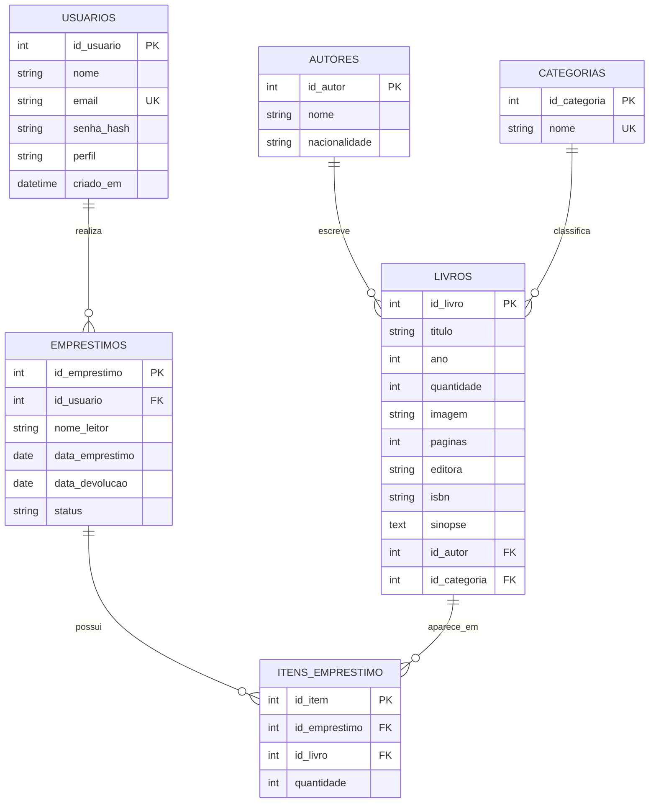

[Ver DER em Markdown](docs/DER.md)

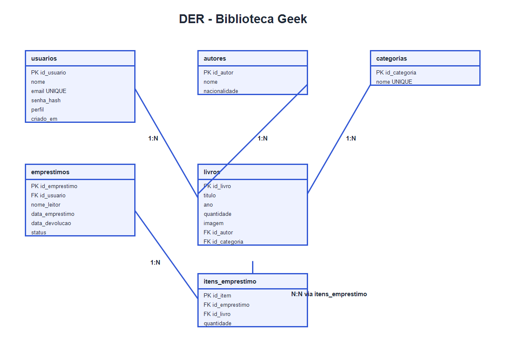

Relacionamentos principais:

- Usuário 1:N Empréstimos.
- Autor 1:N Livros.
- Categoria 1:N Livros.
- Empréstimos N:N Livros por `itens_emprestimo`.

## Demonstração rápida

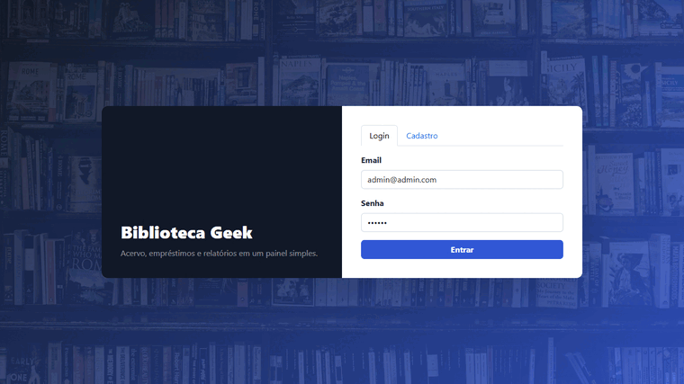

## Screenshots

### Login

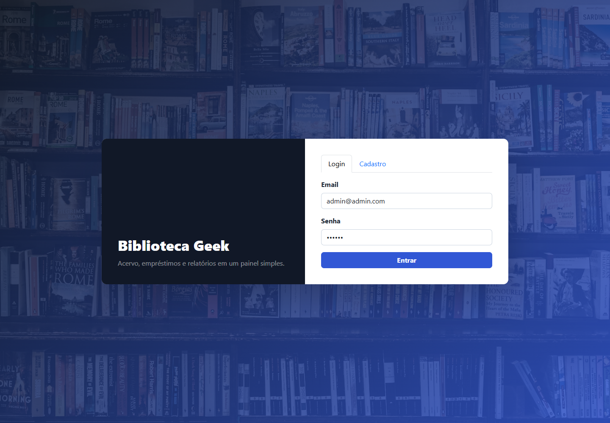

### Dashboard

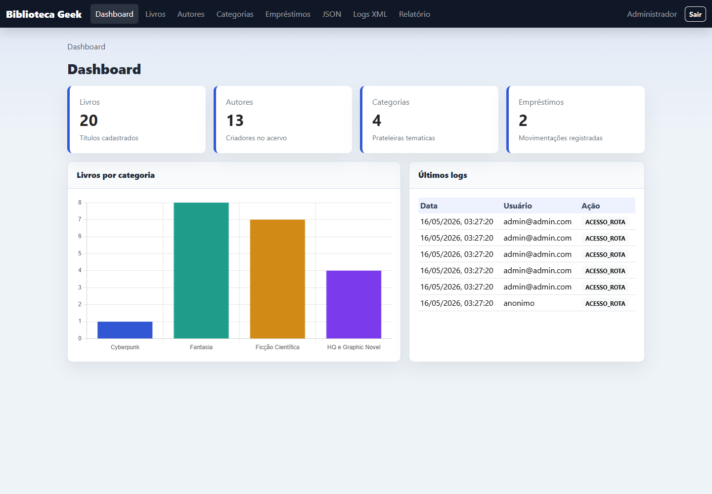

### Livros

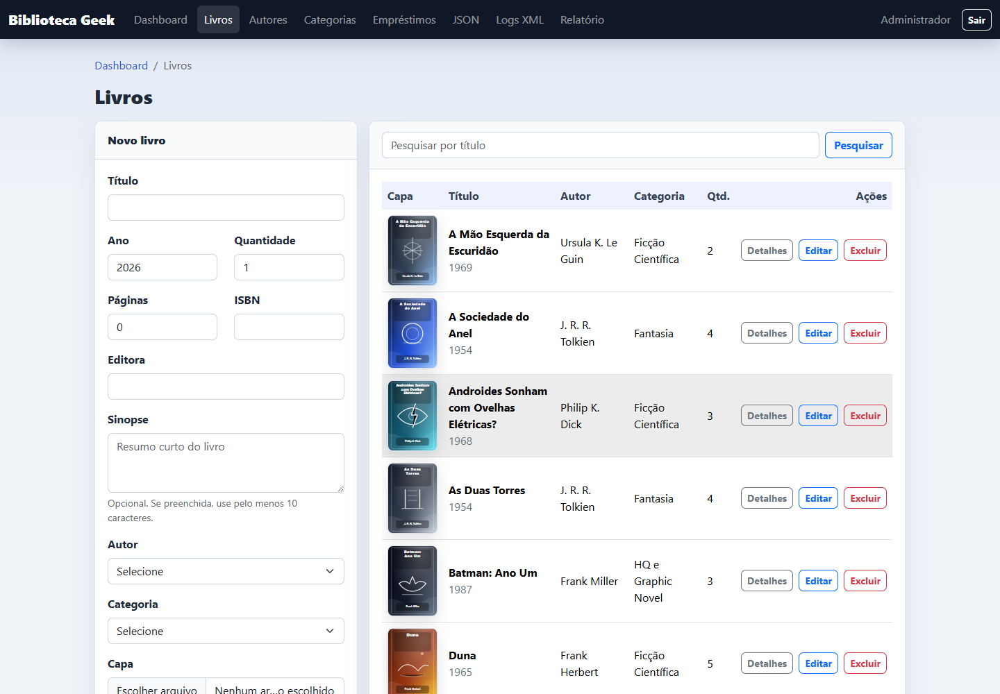

### Autores

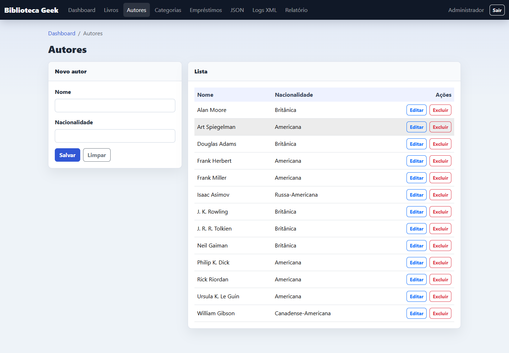

### Categorias

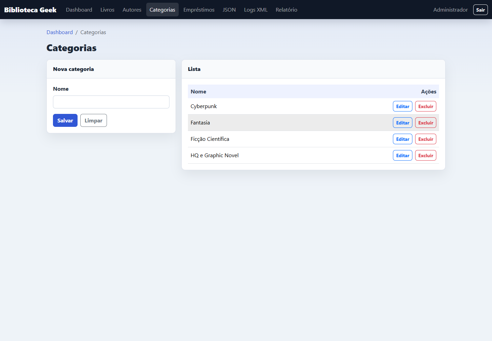

### Empréstimos

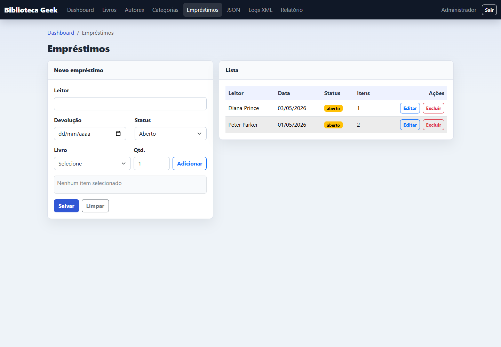

### JSON

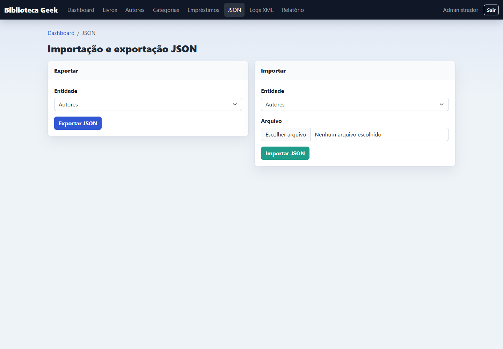

### Logs XML

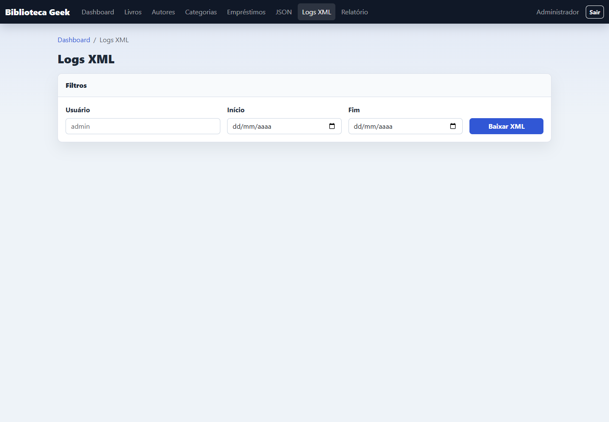

### Relatório PDF

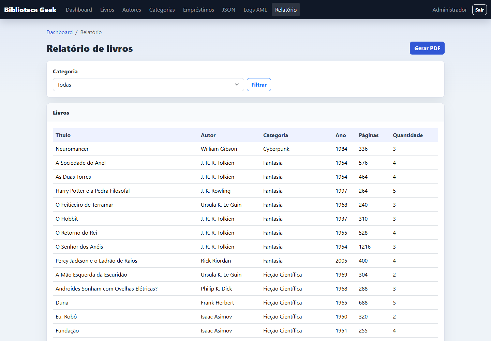

## Pré-requisitos

- Node.js instalado.
- XAMPP com MySQL na porta `3306`.
- MongoDB Community Server instalado.
- Navegador atualizado.
- Git, se quiser versionar ou publicar o projeto.

## Como rodar

1. Abra o XAMPP Control Panel.
2. Inicie o MySQL.
3. Inicie o MongoDB em outra janela:

```text
"C:\Program Files\MongoDB\Server\8.0\bin\mongod.exe" --dbpath C:\data\db
```

4. Crie o arquivo `.env` a partir de `.env.example`.
5. Importe o banco pelo terminal ou pelo phpMyAdmin:

```text
mysql -u root -p < database/schema.sql
mysql -u root -p biblioteca_geek < database/inserts.sql
```

6. Instale as dependências e inicie o sistema:

```text
npm install
npm start
```

7. Acesse:

```text
http://localhost:3000
```

Login de teste:

```text
email: admin@admin.com
senha: 123456
```

## MongoDB e logs

O XAMPP só liga o MySQL. O MongoDB não vem no XAMPP e precisa ficar aberto durante a apresentação.

- URI: `mongodb://127.0.0.1:27017`
- Banco: `biblioteca_geek_logs`
- Collection: `logs`

Para conferir pelo terminal:

```text
npm run check:mongo
```

Para conferir no MongoDB Compass, conecte em `mongodb://127.0.0.1:27017` e abra `biblioteca_geek_logs.logs`.

A exportação XML fica na tela **Logs XML**.

## Relatório PDF

O endpoint `/api/v1/relatorios/livros` retorna os dados em JSON. O frontend gera o PDF com **jsPDF** e **jsPDF AutoTable**, incluindo usuário logado, data e hora, filtro por categoria, tabela, totais e rodapé.

## JSON

A tela **JSON** permite:

- Exportar autores, categorias, livros e empréstimos.
- Importar autores, categorias e livros.
- Validar estrutura.
- Ignorar duplicidades.
- Exibir quantidade de importados, duplicados e erros.

## Upload de imagens

O upload de capa aceita:

- PNG.
- JPG.
- JPEG.
- WEBP.
- Tamanho máximo de 2 MB.

Os livros iniciais usam capas demonstrativas locais em `public/uploads/capas-demo/`, sem depender de API externa.

## Documentação

- [Documentação completa em Markdown](docs/DOCUMENTACAO_COMPLETA.md)
- [Documentação completa em PDF](docs/DOCUMENTACAO_COMPLETA.pdf)
- [Checklist do trabalho](docs/CHECKLIST.md)
- [Endpoints da API](docs/ENDPOINTS.md)
- [Testes da API](docs/TESTES_API.md)
- [Como rodar com XAMPP e MongoDB](docs/COMO_RODAR_XAMPP_MONGODB.md)
- [Roteiro do vídeo](docs/ROTEIRO_VIDEO.md)

## GitHub Pages

Página estática de apresentação:

```text
https://soturine.github.io/biblioteca-geek-fullstack/
```

Aviso: GitHub Pages não roda Node.js, Express, MySQL ou MongoDB. A página em `docs/` é apenas uma apresentação estática.

## Release

Release final:

```text
https://github.com/Soturine/biblioteca-geek-fullstack/releases/tag/v1.0.0
```

ZIP final:

```text
biblioteca-geek-fullstack-final.zip
```

## Licença

Este projeto está sob a licença MIT. Consulte o arquivo [LICENSE](LICENSE).

## Checklist resumido

- Login JWT: implementado.
- CRUD: autores, categorias, livros e empréstimos.
- Pesquisa: livros por título.
- MySQL: 6 tabelas relacionadas.
- MongoDB: logs do sistema.
- JSON: importação/exportação.
- XML: exportação de logs.
- PDF: relatório de livros no frontend.
- Gráfico: Chart.js no dashboard.
- Upload: capa dos livros.
- Modal de detalhes: implementado na tela de livros.
- DER: imagem e Mermaid atualizados.
- Licença MIT: incluída.
- GitHub Pages: página estática em `docs/index.html`.
