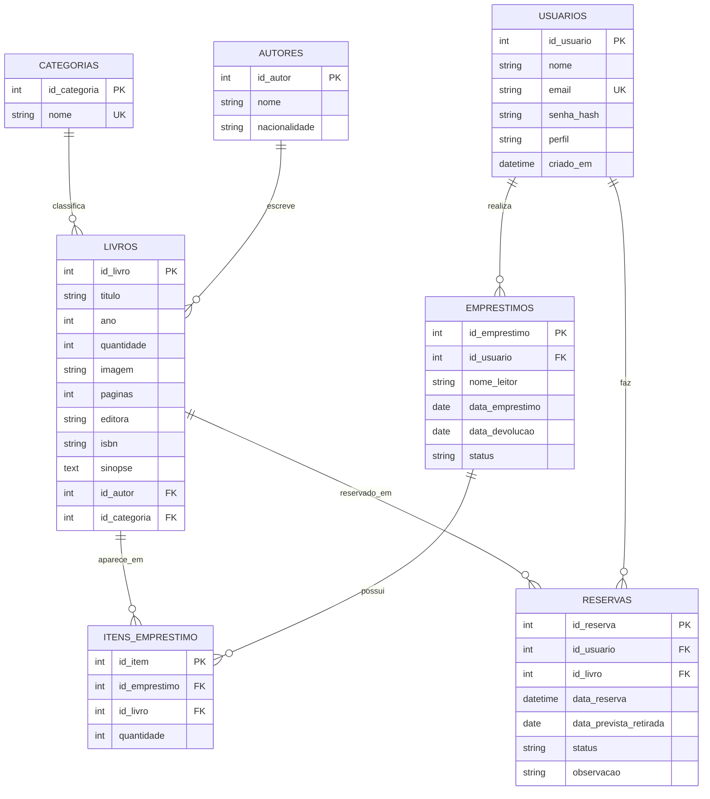

# DER - Biblioteca Geek

```mermaid
erDiagram
    USUARIOS ||--o{ EMPRESTIMOS : realiza
    AUTORES ||--o{ LIVROS : escreve
    CATEGORIAS ||--o{ LIVROS : classifica
    EMPRESTIMOS ||--o{ ITENS_EMPRESTIMO : possui
    LIVROS ||--o{ ITENS_EMPRESTIMO : aparece_em
    USUARIOS ||--o{ RESERVAS : faz
    LIVROS ||--o{ RESERVAS : reservado_em

    USUARIOS {
        int id_usuario PK
        string nome
        string email UK
        string senha_hash
        string perfil
        datetime criado_em
    }

    AUTORES {
        int id_autor PK
        string nome
        string nacionalidade
    }

    CATEGORIAS {
        int id_categoria PK
        string nome UK
    }

    LIVROS {
        int id_livro PK
        string titulo
        int ano
        int quantidade
        string imagem
        int paginas
        string editora
        string isbn
        text sinopse
        int id_autor FK
        int id_categoria FK
    }

    EMPRESTIMOS {
        int id_emprestimo PK
        int id_usuario FK
        string nome_leitor
        date data_emprestimo
        date data_devolucao
        string status
    }

    ITENS_EMPRESTIMO {
        int id_item PK
        int id_emprestimo FK
        int id_livro FK
        int quantidade
    }

    RESERVAS {
        int id_reserva PK
        int id_usuario FK
        int id_livro FK
        datetime data_reserva
        date data_prevista_retirada
        string status
        string observacao
    }
```
