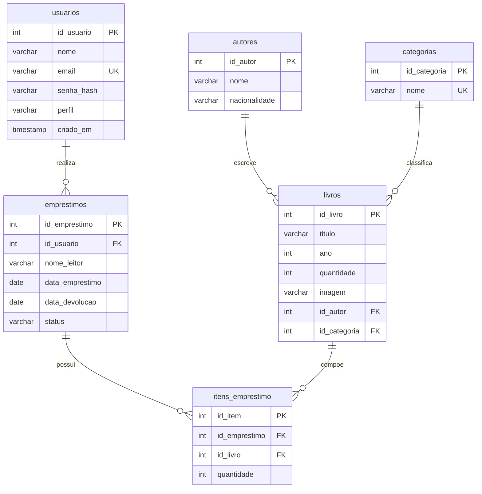

# DER - Biblioteca Geek

```mermaid
erDiagram
  usuarios ||--o{ emprestimos : realiza
  autores ||--o{ livros : escreve
  categorias ||--o{ livros : classifica
  emprestimos ||--o{ itens_emprestimo : possui
  livros ||--o{ itens_emprestimo : compoe

  usuarios {
    int id_usuario PK
    varchar nome
    varchar email UK
    varchar senha_hash
    varchar perfil
    timestamp criado_em
  }

  autores {
    int id_autor PK
    varchar nome
    varchar nacionalidade
  }

  categorias {
    int id_categoria PK
    varchar nome UK
  }

  livros {
    int id_livro PK
    varchar titulo
    int ano
    int quantidade
    varchar imagem
    int id_autor FK
    int id_categoria FK
  }

  emprestimos {
    int id_emprestimo PK
    int id_usuario FK
    varchar nome_leitor
    date data_emprestimo
    date data_devolucao
    varchar status
  }

  itens_emprestimo {
    int id_item PK
    int id_emprestimo FK
    int id_livro FK
    int quantidade
  }
```
