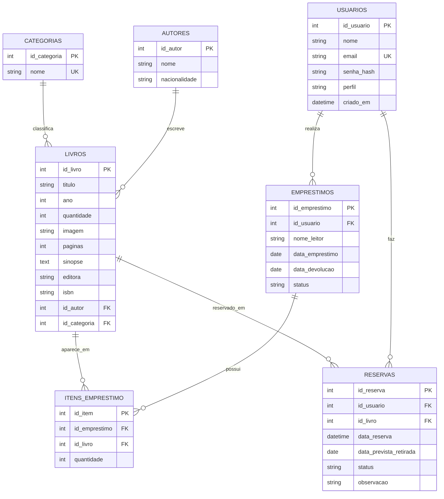

# DER - Biblioteca Geek

O DER representa o banco MySQL principal do sistema. Os logs ficam separados no MongoDB, na collection `logs`.

## Relacionamentos

| Relacionamento              | Tipo | Campo                                   |
| --------------------------- | ---- | --------------------------------------- |
| Usuário realiza empréstimos | 1:N  | `emprestimos.id_usuario`                |
| Autor escreve livros        | 1:N  | `livros.id_autor`                       |
| Categoria classifica livros | 1:N  | `livros.id_categoria`                   |
| Empréstimo possui itens     | 1:N  | `itens_emprestimo.id_emprestimo`        |
| Livro aparece em itens      | 1:N  | `itens_emprestimo.id_livro`             |
| Empréstimos e livros        | N:N  | tabela intermediária `itens_emprestimo` |
| Usuário faz reservas        | 1:N  | `reservas.id_usuario`                   |
| Livro aparece em reservas   | 1:N  | `reservas.id_livro`                     |
