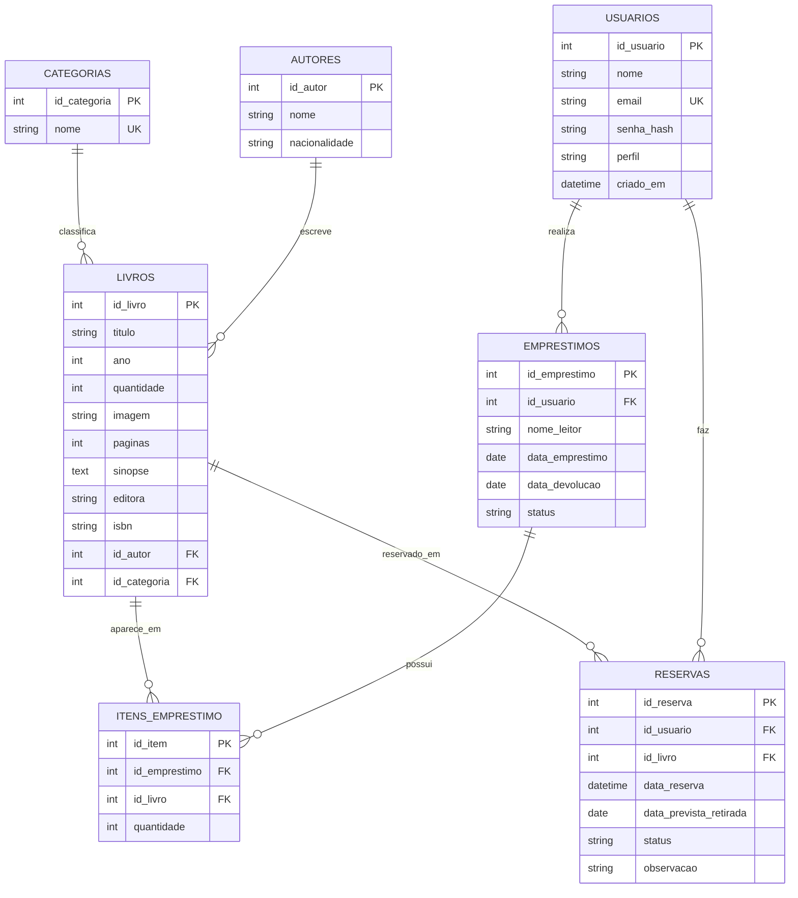

# DER - Biblioteca Geek

O DER representa o banco relacional MySQL principal do sistema **Biblioteca Geek**.
Os logs de requisições, ações de negócio e erros ficam separados no MongoDB, no banco `biblioteca_geek_logs`, collection `logs`.

## Entidades

| Entidade           | Descrição                                                                                         |
| ------------------ | ------------------------------------------------------------------------------------------------- |
| `usuarios`         | Armazena os usuários do sistema, incluindo administradores e leitores.                            |
| `autores`          | Armazena os autores dos livros cadastrados.                                                       |
| `categorias`       | Armazena as categorias usadas para classificar os livros.                                         |
| `livros`           | Armazena os livros do acervo, incluindo capa, quantidade, páginas, editora, ISBN e sinopse.       |
| `emprestimos`      | Armazena os empréstimos realizados no sistema.                                                    |
| `itens_emprestimo` | Liga empréstimos e livros, permitindo que um empréstimo tenha um ou mais livros.                  |
| `reservas`         | Armazena as reservas feitas pelos leitores para livros disponíveis ou aguardando retirada futura. |

## Relacionamentos

| Relacionamento                       | Tipo | Campo usado                          |
| ------------------------------------ | ---- | ------------------------------------ |
| Usuário realiza empréstimos          | 1:N  | `emprestimos.id_usuario`             |
| Usuário faz reservas                 | 1:N  | `reservas.id_usuario`                |
| Autor escreve livros                 | 1:N  | `livros.id_autor`                    |
| Categoria classifica livros          | 1:N  | `livros.id_categoria`                |
| Empréstimo possui itens              | 1:N  | `itens_emprestimo.id_emprestimo`     |
| Livro aparece em itens de empréstimo | 1:N  | `itens_emprestimo.id_livro`          |
| Livro pode ser reservado             | 1:N  | `reservas.id_livro`                  |
| Empréstimos e livros                 | N:N  | relação feita por `itens_emprestimo` |

## Observação sobre MongoDB

O MongoDB não faz parte do DER relacional porque é usado separadamente para registrar logs do sistema.
Ele armazena informações como acessos, ações de negócio, erros, login, reservas, exportação XML e outras requisições importantes para manutenção e auditoria.
