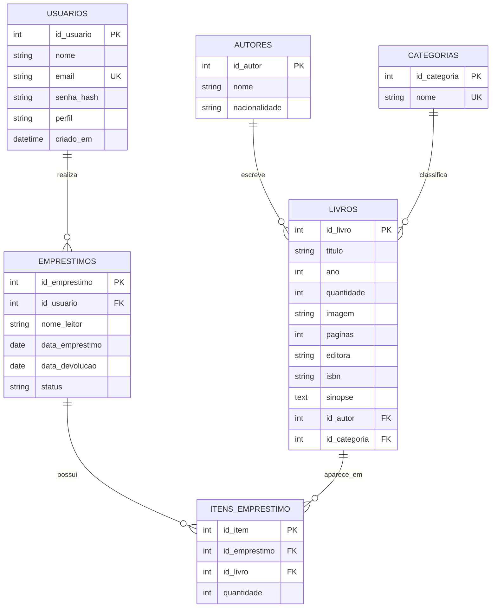

# DER - Biblioteca Geek

## Relacionamentos

| Relacionamento              | Tipo | Implementação                           |
| --------------------------- | ---- | --------------------------------------- |
| Usuário realiza empréstimos | 1:N  | `emprestimos.id_usuario`                |
| Autor escreve livros        | 1:N  | `livros.id_autor`                       |
| Categoria classifica livros | 1:N  | `livros.id_categoria`                   |
| Empréstimo possui itens     | 1:N  | `itens_emprestimo.id_emprestimo`        |
| Livros aparecem em itens    | 1:N  | `itens_emprestimo.id_livro`             |
| Empréstimos e livros        | N:N  | tabela intermediária `itens_emprestimo` |

## Observação

A tabela `livros` possui campos descritivos para melhorar a tela de detalhes e o relatório:
`paginas`, `sinopse`, `editora` e `isbn`.
